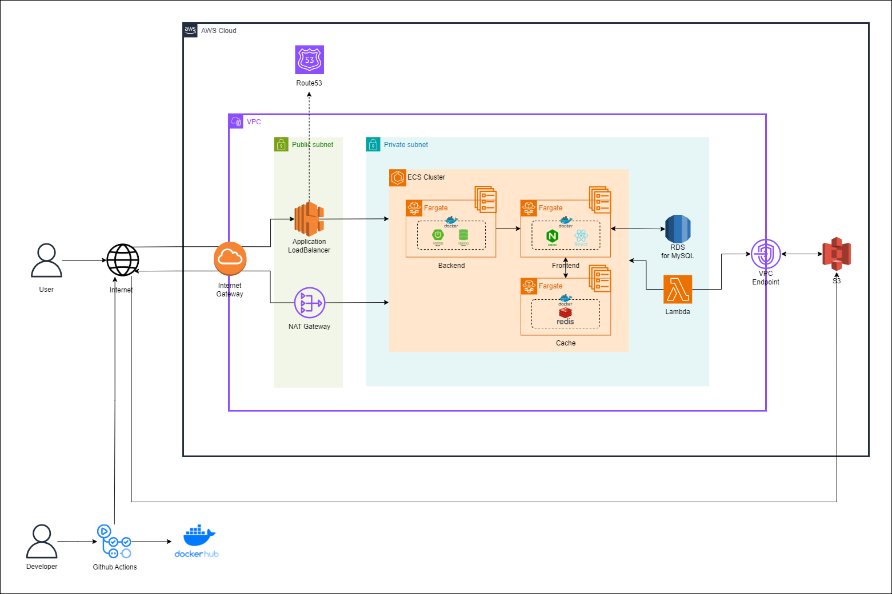
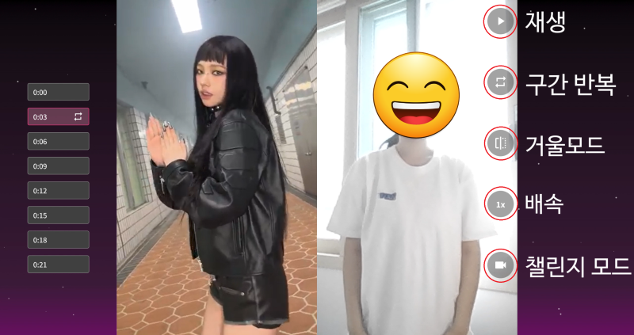
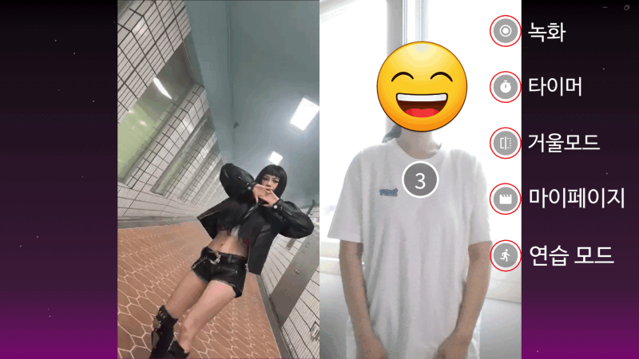
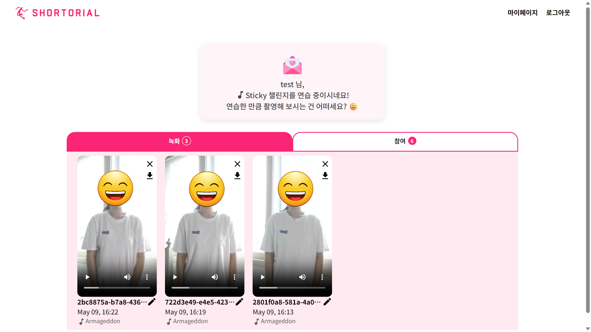
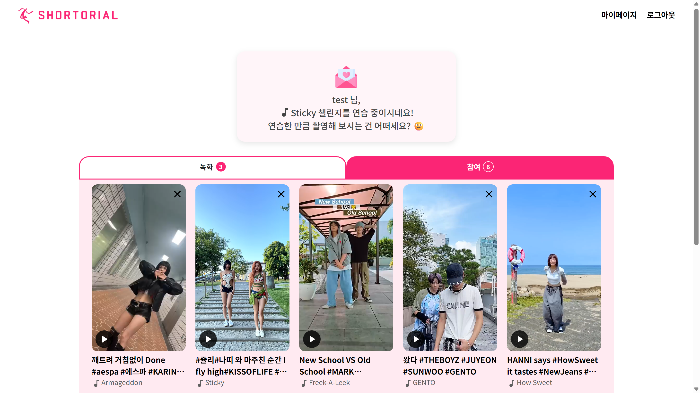

# :dancers: Shortorial(Shorts + Tutorial)을 소개합니다. :tada:

</img>

숏토리얼은 댄스 챌린지를 쉽게 연습하고, 촬영하는 기능을 제공하는 **댄스 챌린지 어시스턴트 서비스** 입니다.

# :white_check_mark: 목적

춤을 처음 배우는 사용자도 쉽게 따라할 수 있도록,  
**구간 반복**과 **속도 조절** 기능을 제공하여 집중적으로 연습할 수 있도록 지원합니다.

반복적인 편집 작업을 줄이고 싶은 사용자를 위해,  
녹화가 끝나면 자동으로 **원본 영상의 음악을 합성**해 편리하게 영상을 완성할 수 있도록 합니다.

멀리 거치된 기기를 오가며 조작하기 번거로운 사용자를 위해,  
챌린지 연습과 녹화 과정에서 **모션 인식**으로 버튼을 누를 수 있도록 구현했습니다.

# :date: 기간

_SSAFY 10기 자율 프로젝트_  
**2024.04.08 - 2024.05.20 (6주)**  
 우수상🏆

_1차 리팩토링_  
**2024.06.05 - 2024.07.24**

_2차 리팩토링_  
**2025.03.03 - 2025.04.22**

# :computer: **Team. 둠칫둠칫**

| 팀원         | 역할   | 담당                                                                                                                                                           |
| ------------ | ------ | -------------------------------------------------------------------------------------------------------------------------------------------------------------- |
| 우지민(팀장) | BE     | 숏폼 영상 조회 및 마이페이지 콘텐츠 API 구현                                                                                                                   |
| 조민준       | INFRA  | AWS EC2 환경 기반 자동 배포 파이프라인 구축                                                                                                                    |
| 전성수       | BE     | JWT 기반 회원 인증 및 인가 API 구현                                                                                                                            |
| 김다윤       | FE, BE | 챌린지 녹화 및 오디오 기능, S3 연동 API 구현  1차 리팩토링: DTO Projection 기반 API 성능 개선  2차 리팩토링: AWS ECS 환경 기반 자동 배포 파이프라인 구축 |
| 이현정       | AI, FE | 모션 기반 제스처 감지 및 UI 제어 기능 구현                                                                                                                     |
| 임지은       | FE     | 챌린지 구간 연습 기능, 랜딩/메인 페이지 구현                                                                                                                   |

# :art: 서비스 아키텍처 & 기술 스택

| Section      | Stack                                                                                                                                                                                                                                                                                                                                                                                                                                                                                                                                                                                                                                                                                                                                                                                                                                                                                                                                     |
| ------------ | ----------------------------------------------------------------------------------------------------------------------------------------------------------------------------------------------------------------------------------------------------------------------------------------------------------------------------------------------------------------------------------------------------------------------------------------------------------------------------------------------------------------------------------------------------------------------------------------------------------------------------------------------------------------------------------------------------------------------------------------------------------------------------------------------------------------------------------------------------------------------------------------------------------------------------------------- |
| **Backend**  |                                                                                                                                                                                                                   |
| **Frontend** |                                                                                                                   |
| **Database** |                                                                                                                                                                                                                                                                                                                                                                                                                                                                                                                                                                                                                                                                                                                               |
| **Infra**    |         |
| **DevTool**  |                                                                                                                                                                                                                                                                                                                                               |
| **Others**   |                                                                                                                                                                                                                                                                                                                                                                                       |

# 💖 서비스 화면 및 기능 상세

<table>
  <tr>
    <th>랜딩 페이지</th>
    <th>메인 페이지</th>
  </tr>
  <tr>
    <td></td>
    <td></td>
  </tr>
  <tr>
    <td>
      - 랜딩 페이지에서 숏토리얼 서비스를 한눈에 파악할 수 있습니다.  
      - 회원가입 및 로그인 후 숏토리얼이 제공하는 숏폼을 연습하거나 촬영할 수 있습니다.
    </td>
    <td>
      - 메인 페이지에서 전체 숏폼과 인기 숏폼 목록을 제공합니다.  
      - 원하는 숏폼을 클릭하면 모달 창에서 숏폼 정보와 챌린저 수를 확인할 수 있습니다.  
    </td>
  </tr>
</table>
<table>
  <tr>
    <th>연습 모드 - 1</th>
    <th>연습 모드 - 2</th>
  </tr>
  <tr>
    <td></td>
    <td></td>
  </tr>
  <tr>
    <td>
      - 연습 모드를 클릭하면 영상이 3초씩 나뉘고, 좌측에 구간 목록이 나타납니다.  
      - 우측에는 재생, 반복(해제), 거울 모드(해제), 배속(1/0.75/0.5x), 챌린지 이동 버튼 세트가 있습니다.  
      - 숏폼이 재생되면 일시정지 버튼으로 교체됩니다. 
    </td>
    <td>
      - 버튼 위에 손을 올려두면 테두리에 게이지가 차오르고, 가득 차면 기능이 실행됩니다.  
      - 손을 좌우로 스와이프하거나 원하는 구간을 직접 클릭해 이동할 수 있습니다.  
      - 구간 반복이 켜지면 선택된 구간만 반복되고, 꺼지면 전체 구간을 순차적으로 재생합니다. 
    </td>
  </tr>
</table>
<table>
  <tr>
    <th>챌린지 모드 - 1</th>
    <th>챌린지 모드 - 2</th>
  </tr>
  <tr>
    <td></td>
    <td></td>
  </tr>
  <tr>
    <td>
      - 챌린지 모드를 클릭하면 웹캠 녹화를 위해 카메라 권한을 요청합니다.   
      - 우측에는 녹화 시작, 녹화 카운트다운(3/5/10초), 거울 모드(해제), 마이 페이지 이동, 연습 모드 이동 버튼 세트가 있습니다.   
      - 녹화가 시작되면 녹화 중지, 저장 버튼 세트로 교체됩니다. 
    <td>
      - 숏폼이 종료되면 녹화된 영상이 자동으로 S3에 업로드 됩니다.  
      - 그 전에 저장 버튼을 실행하면 해당 시점까지 녹화된 영상이 업로드 됩니다.  
      - Lambda는 S3 업로드 이벤트를 감지하여 숏폼의 오디오(음악)를 사용자 영상에 합성하고, 최종 영상을 S3에 업로드합니다. 
    </td>
  </tr>
</table>
<table>
  <tr>
    <th>마이 페이지 - 1</th>
    <th>마이 페이지 - 2</th>
  </tr>
  <tr>
    <td></td>
    <td></td>
  </tr>
  <tr>
    <td>
      - 녹화 탭에서는 사용자가 녹화한 영상 정보와 개수를 확인할 수 있습니다.  
      - 영상 재생, 다운로드, 제목 수정, 삭제 기능을 제공합니다.       
    </td>
    <td>
      - 참여 탭에서는 사용자가 연습한 숏폼 목록과 개수를 확인할 수 있습니다.   
      - 상단에서 연습과 녹화 현황을 비교해 챌린지 참여를 응원하는 메시지를 표시합니다.   
    </td>
  </tr>
  
</table>
