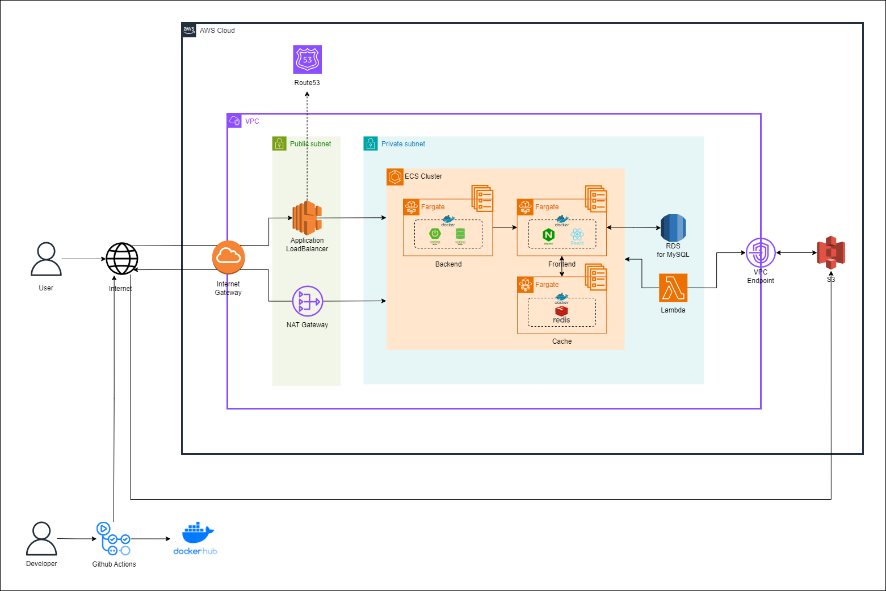

# :dancers: Shortorial(Shorts + Tutorial)을 소개합니다. :tada:

</img>

숏토리얼은 댄스 챌린지를 쉽게 연습하고, 촬영하는 기능을 제공하는 **댄스 챌린지 어시스턴트 서비스** 입니다.

# :white_check_mark: 목적

춤을 처음 배우는 사용자도 쉽게 따라할 수 있도록,  
**구간 반복**과 **속도 조절** 기능을 제공하여 집중적으로 연습할 수 있도록 지원합니다.

반복적인 편집 작업을 줄이고 싶은 사용자를 위해,  
녹화가 끝나면 자동으로 **원본 영상의 음악을 합성**해 편리하게 영상을 완성할 수 있도록 합니다.

멀리 거치된 기기를 오가며 조작하기 번거로운 사용자를 위해,  
챌린지 연습과 녹화 과정에서 **모션 인식**으로 버튼을 누를 수 있도록 구현했습니다.

# :date: 기간

_SSAFY 10기 자율 프로젝트_  
**2024.04.08 - 2024.05.20 (6주)**

_1차 리팩토링_  
**2024.06.05 - 2024.07.24**

_2차 리팩토링_  
**2025.03.03 - 2024.04.22**

# :computer: **Team. 둠칫둠칫**

| 팀원         | 역할   | 담당                                                                                                                                                           |
| ------------ | ------ | -------------------------------------------------------------------------------------------------------------------------------------------------------------- |
| 우지민(팀장) | BE     | 숏폼 영상 조회 및 마이페이지 콘텐츠 API 구현                                                                                                                   |
| 조민준       | INFRA  | AWS EC2 환경 기반 자동 배포 파이프라인 구축                                                                                                                    |
| 전성수       | BE     | JWT 기반 회원 인증 및 인가 API 구현                                                                                                                            |
| 김다윤       | FE, BE | 챌린지 녹화 및 오디오 기능, S3 연동 API 구현  1차 리팩토링: DTO Projection 기반 API 성능 개선  2차 리팩토링: AWS ECS 환경 기반 자동 배포 파이프라인 구축 |
| 이현정       | AI, FE | 모션 기반 제스처 감지 및 UI 제어 기능 구현                                                                                                                     |
| 임지은       | FE     | 챌린지 구간 연습 기능, 랜딩/메인 페이지 구현                                                                                                                   |

# :zap: 서비스 아키텍처 & 기술 스택

<table>
  <tr>
    <th style="border-right:1px solid gray; padding-right:10px; text-align:center;">Backend</th>
    <th style="border-right:1px solid gray; padding-right:10px; text-align:center;">Frontend</th>
    <th style="border-right:1px solid gray; padding-right:10px; text-align:center;">Database</th>
    <th style="border-right:1px solid gray; padding-right:10px; text-align:center;">Infra</th>
    <th style="border-right:1px solid gray; padding-right:10px; text-align:center;">DevTool</th>
    <th style="border-right:1px solid gray; padding-right:10px; text-align:center;">Others</th>
  </tr>
  <tr>
    <td style="border-right:1px solid gray; text-align:center;">
      
      
      
      
      
      
    </td>
    <td style="border-right:1px solid gray; text-align:center;">
      
      
      
      
      
      
      
    </td>
    <td style="border-right:1px solid gray; text-align:center;">
      
      
    </td>
    <td style="border-right:1px solid gray; text-align:center;">
      
      
      
      
      
      
      
      
    </td>
    <td style="border-right:1px solid gray; text-align:center;">
      
      
      
      
      
    </td>
    <td style="border-right:1px solid gray; text-align:center;">
      
      
      
      
      
    </td>

  </tr>
</table>

# ❤ 주요 기능

#### 1. 연습 모드

- 웹캠 또는 핸드폰 카메라를 전신 거울 삼아 언제 어디서든 영상을 보며 춤을 따라 출 수 있습니다.
- 영상의 구간 반복, 배속 변경, 좌우 반전의 기능으로 편리한 연습 환경을 제공합니다.
- 모션 인식을 이용한 유사도 측정으로 점수를 표시해줍니다.
- 모션 인식을 통해 오른손의 위치를 감지하고, 오른손이 카메라상의 버튼 위치에 닿으면 버튼이 활성화되어 기능이 작동합니다.

#### 2. 챌린지 모드

- 챌린지를 촬영하고 저장합니다.
- 촬영된 영상은 마이페이지에서 확인하실 수 있습니다.
- 모션 인식을 통해 오른손의 위치를 감지하고, 오른손이 카메라상의 버튼 위치에 닿으면 버튼이 활성화되어 기능이 작동합니다.

# 주요 화면

#### 랜딩 페이지

#### 메인 페이지

- 추천 쇼츠 챌린지, 인기 쇼츠 챌린지, 전체 쇼츠 챌린지
- 쇼츠 상세 정보  
  

#### 연습 모드

- 연습 모드 화면 구성
- 영상을 일정 시간마다 나누어 여러 구간으로 표시
- 구간 반복, 거울 모드(좌우 반전), 배속 변경 기능 사용 가능  
  

- 모션 인식을 활용한 버튼 클릭  
  

- 손 제스처로 구간 이동  
  

#### 챌린지 모드

- 챌린지 모드 화면 구성
- 영상 녹화 가능
- 타이머, 거울 모드(좌우 반전) 기능 사용 가능  
  

- 모션 인식을 활용한 버튼 클릭  
  

- 녹화 후 영상 저장  
  

#### 마이 페이지

- 촬영한 영상과 시도한 영상 확인  
  
